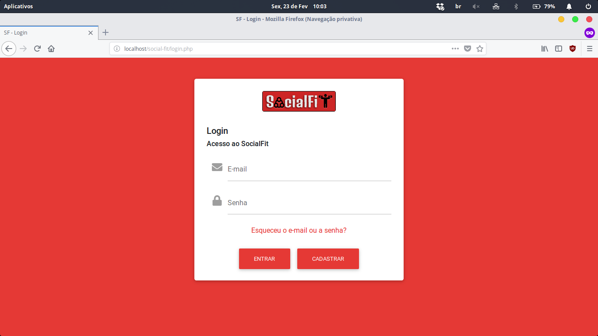
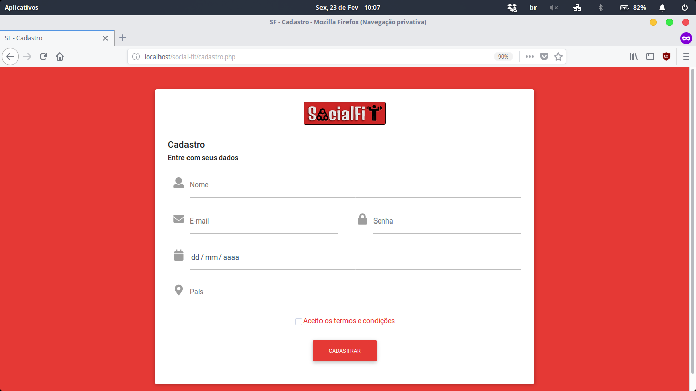
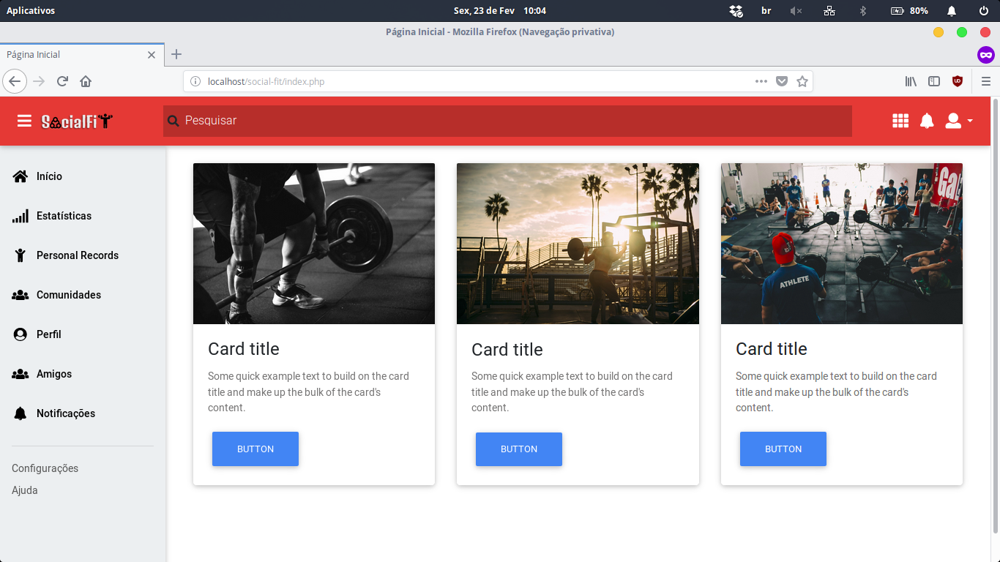
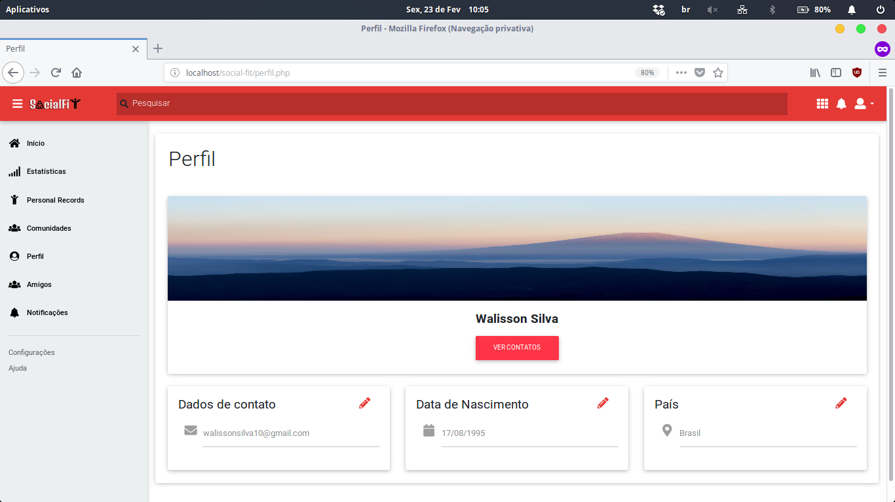
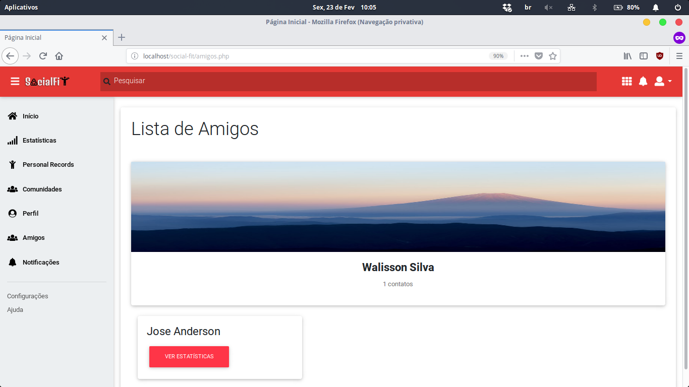
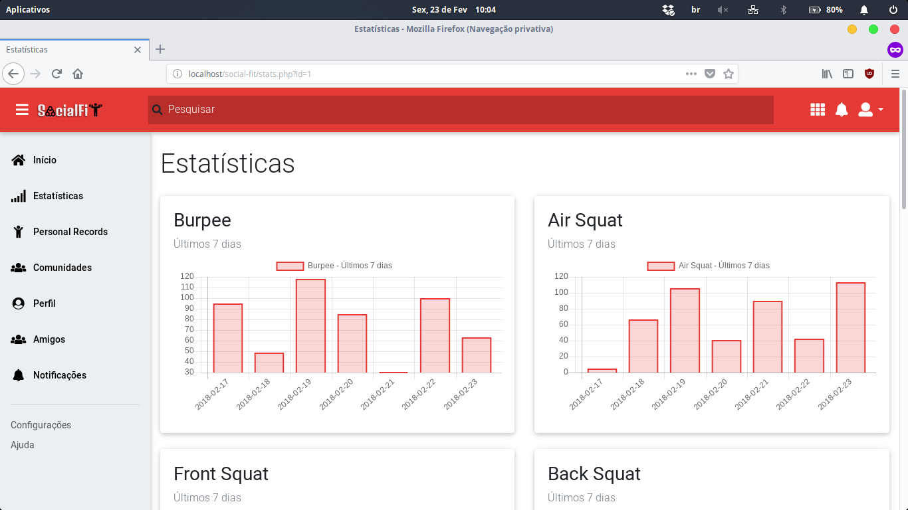
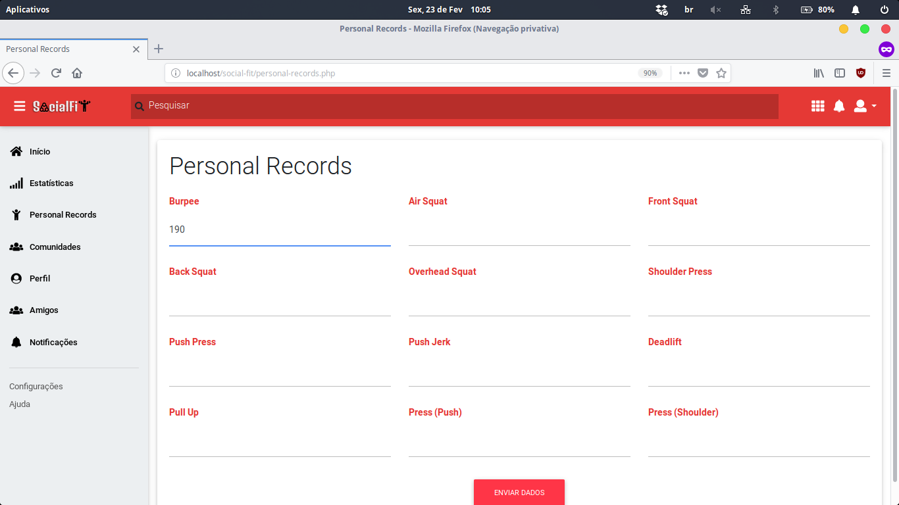

# SocialFIT


## Descrição

Rede social destinada às pessoas envolvidas em atividades físicas como Academia e CrossFit de forma que elas possam compartilhar seus resultados com os amigos. Também se destina à divulgação de eventos relacionados à área o que seria interessante para as empresas envolvidas nesta área.

Projeto desenvolvido por:

- [José Anderson Silva dos Santos](https://github.com/joseanderson1995silva)
- [Walisson da Silva Soares](https://www.walissonsilva.com)

## Inspiração

A ideia do projeto surge de projetos anteriores realizados na área de Engenharia Biomédica como sensores de parâmetros fisiológicos para a disciplina de Instrumentação Eletrônica. A banca sugeriu a implementação de uma rede social para as pessoas compartilharem as atividades físicas realizadas e também para a divulgação de eventos na área.

Além disso, pode-se elencar as seguintes inspirações:

* Observa-se um crescente interesse pelo crossfit, pelas academias e a cultura fitness no mundo, no Brasil e, mais especificamente, em João Pessoa;
* Observou-se um forte interesse de compartilhar e comparar o desempenho com outras pessoas, além de tomar o conhecimento de eventos de crossfit, os quais são bastante valorizados pelos envolvidos nessas atividades;
* Avalia-se a possibilidade de integrar dispositivos vestíveis (wearables) para obter dados das atividades realizadas pelos usuários, a fim de alimentar os dados do sistema.

<!-- ## Protótipos -->


## Requisitos mínimos e instalação

Para utilização do SocialFIT é necessário a criação de um servidor *web*. Isto pode ser feito instalando o servidor LAMP que no Ubuntu e derivados pode ser feito através do comando:

```
sudo apt install lamp-server^
```

Caso você esteja utilizando o Debian ou derivados, utilize o comando abaixo:

```
sudo apt-get install apache2 php7 mysql-server mysql-client php7-mysql
```

Este comando irá instalar o Apache (servidor), o MySQL (banco de dados) e o PHP.

Em seguida, é necessário clonar esse repositório na pasta `/var/www/html/`. Para isso, execute os comandos abaixo:

```
cd /var/www/html/
```

```
git clone https://github.com/social-fit/social-fit.git
```

Por fim, é necessário criar o banco de dados `social_fit` em seu computador. Para isso, acesse o seu banco de dados MySQL:

```
mysql -r root -p
```

Informe a sua senha. Após a autenticação, digite o comando abaixo:

```
SOURCE /var/www/html/social-fit/sql/database.sql;
```

Pronto! Está tudo configurado! Agora você pode acessar o sistema digitando `localhost/social-fit` no seu navegador. ;)

## Recursos da API


### Cadastro

A página de cadastro pode ser acessada através do link:

```
/cadastro.php
```

Os dados são passados através do método POST.
Para executar a ação de cadastro é necessário utilizar os seguintes parâmetros:

|    **Nome**   |  **Tipo**  |           **Descrição**           |
|:---------:|:------:|:-----------------------------:|
| :nome     | String |        Nome do Usuário        |
| :email    | String |       E-mail do Usuário       |
| :senha    | String |        Senha do Usuário       |
| :datanasc |  Date  | Data de Nascimento do Usuário |
| :pais     | String |   País de origem do Usuário   |
| :sexo     | String |                               |

Em caso de sucesso:

```
Cadastro realizado com sucesso
```
No caso de haver campos vazios:

```
Você precisa preencher todos os campos.
```
ou

```
Você precisa aceitar os termos e condições.
```

Para cadastro já existente:

```
Usuário já existente.
```

Em caso de erro:

```
Não foi possível realizar o seu cadastro.
```

Para apresentar a mensagem de erro foi utilizado um alert:

```
<script> document.querySelector('#alert-cadastro').innerHTML = '<div class=\"alert alert-info alert-dismissible fade show my-3\" role=\"alert\"><strong>Ops!</strong> Texto <button type=\"button\" class=\"close\" data-dismiss=\"alert\" aria-label=\"Close\"><span aria-hidden=\"true\">&times;</span></button></div>' </script>
```

Para executar o serviço foi utilizado o comando no MySQL:

```
INSERT INTO Usuario (nome, email, senha, sexo, datanasc, pais) VALUES ('$nome', '$email', '$senha', '$sexo', date('$datanasc'), '$pais');
```

### Login

A página de login pode ser acessada através do link:

```
/login.php
```

Os dados são passados através do método POST.
Para executar a ação de login é necessário utilizar os seguintes parâmetros:

|    **Nome**   |  **Tipo**  |           **Descrição**           |
|:---------:|:------:|:-----------------------------:|
| :email    | String |       E-mail do Usuário       |
| :senha    | String |        Senha do Usuário       |


Em caso de sucesso, é executado o comando:

```
<script> window.location = \"index.php\" </script>
```
Ele redireciona para a página inicial.

No caso de haver campos vazios:

```
Você precisa preencher todos os campos.
```


Em caso de erro, utilizando um alert:

```
<strong>Ops!</strong> Usuário ou senha inválidos.
```

Para executar o serviço foi utilizado o comando no MySQL e verificando os usuários existentes.

```
SELECT * FROM Usuario
```

### Perfil

A página de login pode ser acessada através do link:

```
/php/loadProfile.php
```

Os dados são passados através do método POST.
Para executar a ação de login é necessário utilizar os seguintes parâmetros:

|    **Nome**   |  **Tipo**  |           **Descrição**           |
|:---------:|:------:|:-----------------------------:|
| :nome     | String |        Nome do Usuário        |
| :email    | String |       E-mail do Usuário       |
| :datanasc |  Date  | Data de Nascimento do Usuário |
| :pais     | String |   País de origem do Usuário   |

Em caso de sucesso:

```
{
    nome: "Jose Anderson", 
    email: "joseanderson1995silva@gmail.com",
    datanasc: "29/04/1995",
    pais: "Brasil"
}
```


Em caso de erro, não mostra nada:

Para executar o serviço foi utilizado o comando no MySQL e verificando o usuário da sessão.

```
SELECT * From Usuario WHERE Usuario.id = '$id'
```

## Telas do Sistema

### Login



### Cadastro



### Homepage



### Perfil



### Amigos



### Estatísticas



### Personal Records




